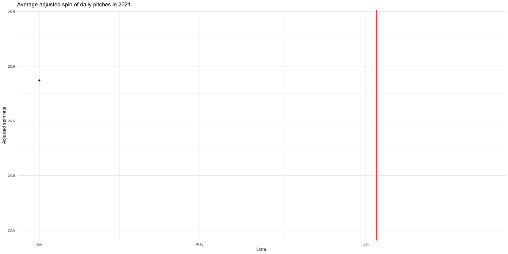

The following analysis was the basis for The Washington Post story: [How baseball’s war on sticky stuff is already changing the game](https://www.washingtonpost.com/sports/2021/07/02/sticky-stuff-baseball-data/)


```{r setup, warning=F, message=F}
knitr::opts_chunk$set(warning = F)
knitr::opts_chunk$set(message = F)

# install packages if missing
packages <- c("tidyverse", "readxl", "janitor",
              "gghighlight", "lubridate", "DT", "knitr", "ggtext")
if (length(setdiff(packages, rownames(installed.packages()))) > 0) {
  install.packages(setdiff(packages, rownames(installed.packages())), repos = "http://cran.us.r-project.org")  
}

# load libraries
library(tidyverse)
library(readxl)
library(janitor)
library(lubridate)
library(knitr)
library(ggrepel)
library(DT)
library(ggtext)

# Load data and specify pitch types, results, and outcomes
pitches <- read_csv("../../data/clean_data/combined_2017_2021.csv") %>%
  mutate(pitch_type=case_when(
    pi_pitch_type=="CH" ~ "changeup",
    pi_pitch_type=="SI" ~ "sinker",
    pi_pitch_type=="SL" ~ "slide",
    pi_pitch_type=="CU" ~ "knuckle curve",
    pi_pitch_type=="FA" ~ "fastball",
    pi_pitch_type=="FC" ~ "cutter",
    pi_pitch_type=="KN" ~ "knuckleball",
    pi_pitch_type=="SB" ~ "screwball",
    pi_pitch_type=="FS" ~ "sinking fastball/splitter",
    pi_pitch_type=="CS" ~ "curve, slow",
  ),
  pitch_results=case_when(
    pitch_result=="B" ~ "ball",
    pitch_result=="F" ~ "foul",
    pitch_result=="FB" ~ "fly ball/popup",
    pitch_result=="GB" ~ "ground ball",
    pitch_result=="LD" ~ "line drive",
    pitch_result=="PU" ~ "fly ball/popup",
    pitch_result=="S" ~ "strike"
  ),
  pitch_outcomes=case_when(
    pitch_outcome=="1B" ~ "first base",
    pitch_outcome=="2B" ~ "second base",
    pitch_outcome=="3B" ~ "third base",
    pitch_outcome=="B" ~ "ball",
    pitch_outcome=="F" ~ "foul",
    pitch_outcome=="HR" ~ "homerun",
    pitch_outcome=="OUT" ~ "out",
    pitch_outcome=="S" ~ "strike",
    pitch_outcome=="HBP" ~ "hit by pitch",
    pitch_outcome=="NIP" ~ "not in play",
    pitch_outcome=="RBOE" ~ "reached base on error"
  )) %>% 
  mutate(bauer_units=rpm/mph)

# Bring in salary data (artifact of older analysis, not necessary in this one)
salaries <- read_csv("../../data/clean_data/salary_lut.csv") %>% 
  mutate(salary=gsub("\\$", "", salary),
         salary=as.numeric(gsub(",", "", salary))) %>% 
  mutate(rank=rank(desc(salary)))

# figuring out the highest 30 paid pitchers
salaries30 <- salaries %>% 
  arrange(desc(salary)) 

salaries30 <- head(salaries, 30)

# isolating the names of the top 30-paid pitchers
sel_names <- as.character(salaries30$mlbid)
```



### Toplines 

All mentions of spin rate are adjusted for velocity.

* The average spin rates for fastballs from pitchers have been climbing year over year since 2017 but in the three weeks after June 3 of 2021, the average to levels lower than they've ever been before spin data began being tracked

*Nearly 70% of pitchers who threw more than 10 fastballs after June 3 saw a decrease in their average adjusted spin rates compared to the earlier 2021 season

* The data is on spin is new– less than five years of data has been collected. Experts are still trying to determine the effects of really high spin rates, but the data shows that spin rates have of many pitchers increased year over year since 2017

* For many, the spin rates peaked in 2020 and 2021 but has since declined after June 3 (nearly half the players)
  * Like Trevor Bauer, Gerrit Cole, Brad Boxberger, Lucas Sims, Tyler Mahle, and Adam Ottavino (and Junior Guerra and Burch Smith)

* Some teams in particular have also been increasing their spin rates every season since 2017
  * More than half of teams have been growing spin rates and saw a drop after June 3
  * A handful of them, such as the Cincinnati Reds and Brewers have seen a dramatic drop after June 3

* Some teams saw increase in the spin rates of the pitchers who joined them compared to their prior team the year before.
  * The average spin rate increase is .35 when pitchers get traded to a new team but there are 8 teams that are more than 3 -5 times that
  * The Astros, Brewers, Cardinals, and Padres each had notable increases in recent years

* It's still too early to say what the effects of lower spin rates have had on games
  * The average number of hard hits from fast ball pitches have increased on average per game

```{r change}
#Average adjusted spin rate by time period

ba <- pitches %>% 
  filter(pitch_type=="fastball") %>% 
  mutate(when=case_when(
    year(game_date)==2017 ~ "2017",
    year(game_date)==2018 ~ "2018",
    year(game_date)==2019 ~ "2019",
    year(game_date)==2020 ~ "2020",
    year(game_date)==2021 & game_date < ymd("2021-06-03") ~ "2021",
    game_date >= ymd("2021-06-03") ~ "after June 3",
    TRUE ~ "missing"
  )) %>% 
  group_by(when) %>% 
  summarize(avg_rpm=round(mean(rpm, na.rm=T),1),
            avg_bu=round(mean(bauer_units, na.rm=T),2)) 
```


### 1. Spin rates by season {.tabset}

The average spin rates for fastballs from pitchers have been climbing year over year since 2017 but in the three weeks after June 3 of 2021, the average to levels lower than they've ever been before spin data began being tracked.

#### Chart

```{r change_chart, fig.height=3}
# charting the time periods

ba %>% ggplot(aes(x=when, y=avg_bu)) +
  geom_col() +
  #ylim(20, 25) +
  coord_cartesian(ylim = c(20, 25)) +
  theme_minimal() +
  labs(x="", y="Average RPM", title="Average adjusted fastball spin rate by season")

#write_csv(ba, "../outputs/graphics_data/annual_average_trend.csv", na="")
#ggsave("outputs/graphics_data/annual_average_trend.svg", width=10, height=5)
```

#### Table

```{r change_table}
#table tab

kable(ba)
```


### 2. Sanity check {.tabset}

The drop is still stark even when limiting the universe to before June 3 and June 3 and June 24 (which is how far we have in the data).

```{r change_restricted, fig.height=4}
# adding even more time frames

ba_restricted <- pitches %>% 
  filter(pitch_type=="fastball") %>% 
  mutate(when=case_when(
    year(game_date)==2017 & game_date < ymd("2017-06-03") ~ "2017 before",
    year(game_date)==2017 & game_date > ymd("2017-06-03") & game_date <= ymd("2021-06-17")~ "2017 after",
    
    year(game_date)==2018 & game_date < ymd("2018-06-03") ~ "2018 before",
    year(game_date)==2018 & game_date > ymd("2018-06-03") & game_date <= ymd("2021-06-17")~ "2018 after",
    
    year(game_date)==2019 & game_date < ymd("2019-06-03") ~ "2019 before",
    year(game_date)==2019 & game_date > ymd("2019-06-03") & game_date <= ymd("2019-06-17")~ "2019 after",
    
    year(game_date)==2020 & game_date < ymd("2020-06-03") ~ "2020 before",
    year(game_date)==2020 & game_date > ymd("2020-06-03") & game_date <= ymd("2020-06-17")~ "2020 after",
    
    year(game_date)==2021 & game_date < ymd("2021-06-03") ~ "2021 before",
    year(game_date)==2021 & game_date > ymd("2021-06-03") & game_date <= ymd("2021-06-17")~ "2021 after",
    
    TRUE ~ "missing"
  )) %>% 
  group_by(when) %>% 
  summarize(avg_rpm=round(mean(rpm, na.rm=T),1),
            avg_bu=round(mean(bauer_units, na.rm=T),1)) %>% 
  filter(when!="missing") %>% 
  mutate(year=gsub(" .*", "", when),
         type=gsub(".* ", "", when)) %>% 
  mutate(year=as.character(year)) %>% 
  mutate(type_order=case_when(
    type=="before" ~ 1,
    type=="after" ~ 2
  ))

# slopegraph
ba_restricted %>% 
  ggplot(aes(x=fct_reorder(type, type_order), y=avg_bu, group=year, color=year)) +
  geom_line() +
  # NEW CODE BELOW
  #gghighlight(year) +
  theme_minimal() +
  labs(y="Average Bauer Units",
       x="Before and after June 3 of each year",
       title="Average fastball adjusted spin rates for each season through June 16")
```

### 3. Pitchers who improved but then dropped {.tabset}

```{r overall_table}

# looking only at fastball pitches adjusted spin rates before and after in 2021
# and then calculating the percent change between those two time periods

ba <- pitches %>% 
  filter(pitch_type=="fastball") %>% 
  filter(year==2021) %>% 
  mutate(when=case_when(
    game_date >= ymd("2021-06-03") ~ "after",
    TRUE ~ "before"
  )) %>% 
  group_by(pitcher_team, pitcher_mlbid, pitcher_name, when) %>% 
  summarize(avg_bu=mean(bauer_units, na.rm=T)) %>% 
  pivot_wider(names_from="when", values_from="avg_bu") %>% 
  mutate(percent_change=round((after-before)/before*100,1))

# looking only at fastball pitches adjusted spin rates before and after in 2021
# and counting up the number of fastballs thrown in each period

ba2 <- pitches %>% 
  filter(pitch_type=="fastball") %>% 
  filter(year==2021) %>% 
  mutate(when=case_when(
    game_date >= ymd("2021-06-03") ~ "after",
    TRUE ~ "before"
  )) %>% 
  mutate(when_count=case_when(
    game_date >= ymd("2021-06-03") ~ 1,
    TRUE ~ 0
  )) %>% 
  group_by(pitcher_team, pitcher_mlbid, pitcher_name) %>% 
  summarize(fastballs_total=n(),
            fastballs_after=sum(when_count)) 

# joining the two dataframes together
ba3 <- left_join(ba, ba2)# %>% 
 # mutate(pitcher_mlbid=as.character(pitcher_mlbid))

# bringing in salary data for no reason anymore
ba3 <- ba3 %>% 
   left_join(salaries, by=c("pitcher_mlbid"="mlbid"))

# looking only at pitchers who've pitched more than 10 times after June 3
# and ranking their percent change before and after June 3
ba3 <- ba3 %>% 
  rename(salary_rank=rank) %>% 
  filter(fastballs_after>=10) %>% 
  ungroup() %>% 
  mutate(bu_rank=rank(percent_change))

# calculating average adjusted fastball spin rates for each pitcher during each time period
year_over_year <- pitches %>% 
  filter(pitch_type=="fastball") %>% 
  mutate(when=case_when(
    year(game_date)==2017 ~ "2017",
    year(game_date)==2018 ~ "2018",
    year(game_date)==2019 ~ "2019",
    year(game_date)==2020 ~ "2020",
    year(game_date)==2021 & game_date < ymd("2021-06-03") ~ "2021",
    game_date >= ymd("2021-06-03") ~ "after June 3",
    TRUE ~ "missing"
  )) %>% 
  group_by(when, pitcher_name, pitcher_mlbid) %>% 
  summarize(avg_rpm=round(mean(rpm, na.rm=T),1),
            avg_bu=round(mean(bauer_units, na.rm=T),2)) 

# calculating average adjusted fastball spin rates for pitchers for each time period 
# but this time filtering for a pitcher's first year as long as it isn't 2020
year_over_year1 <- pitches %>% 
  filter(pitch_type=="fastball") %>% 
  mutate(when=case_when(
    year(game_date)==2017 ~ "2017",
    year(game_date)==2018 ~ "2018",
    year(game_date)==2019 ~ "2019",
    year(game_date)==2020 ~ "2020",
    year(game_date)==2021 & game_date < ymd("2021-06-03") ~ "2021",
    game_date >= ymd("2021-06-03") ~ "after June 3",
    TRUE ~ "missing"
  )) %>% 
  group_by(when, pitcher_name, pitcher_mlbid) %>% 
  summarize(avg_rpm=round(mean(rpm, na.rm=T),1),
            avg_bu=round(mean(bauer_units, na.rm=T),2)) %>% 
  filter(when!="missing" & when!="after June 3") %>% 
  group_by(pitcher_name, pitcher_mlbid) %>% 
  arrange(when) %>% 
  slice(1) %>% 
  mutate(year_off="earliest year") %>% 
  filter(when!="2020")

# calculating average adjusted fastball spin rates for pitchers for each time period 
# but this time filtering 2020
year_over_year2 <- pitches %>% 
  filter(pitch_type=="fastball") %>% 
  mutate(when=case_when(
    year(game_date)==2017 ~ "2017",
    year(game_date)==2018 ~ "2018",
    year(game_date)==2019 ~ "2019",
    year(game_date)==2020 ~ "2020",
    year(game_date)==2021 & game_date < ymd("2021-06-03") ~ "2021",
    game_date >= ymd("2021-06-03") ~ "after June 3",
    TRUE ~ "missing"
  )) %>% 
  group_by(when, pitcher_name, pitcher_mlbid) %>% 
  summarize(avg_rpm=round(mean(rpm, na.rm=T),1),
            avg_bu=round(mean(bauer_units, na.rm=T),2)) %>% 
  filter(when=="2020")  %>% 
  mutate(year_off="last year")

# joining these two annual dataframes
# and then spreading out the data so it's easier to calculate the percent change
# from earliest year and 2020
year_over_year3 <- rbind(year_over_year1, year_over_year2) 
year_over_year3 <- year_over_year3 %>%
  ungroup() %>% 
  select(-when, -avg_rpm) %>% 
  pivot_wider(names_from="year_off", values_from="avg_bu")

year_over_year3 <- year_over_year3 %>% 
  mutate(annual_growth=round((`last year`-`earliest year`)/`earliest year`*100,2))

# filtering this for more than 10 pitches after June 3
ba4 <- full_join(ba3 %>% filter(fastballs_after>=10), year_over_year3)

# adding some labels to indicate if adjusted spin rates increased or decreased
ba_aggregate <- ba3 %>% 
  filter(fastballs_after>=10) %>% 
  mutate(more_less=case_when(
    percent_change >0 ~ "Increased",
    percent_change <0 ~ "Decreased",
    TRUE ~ "Other"
  )) %>% 
  count(more_less) %>% 
  mutate(percent=round(n/sum(n)*100,2))

# looking at those who've decreased
decreased <- filter(ba_aggregate, more_less=="Decreased") %>% 
  pull(percent)

# not using anywhere but just wanted to see
# only the pitchers with data in the two fields we care about
# percent change from their earliest year to 2020
# and percent change from 2021 to post June 3 2021
ba4_aggregate <- ba4 %>%
  filter(fastballs_after>=10) %>% 
  filter(!is.na(percent_change) & !is.na(annual_growth))  %>% 
  mutate(changed=case_when(
    annual_growth >0 & percent_change <0 ~ 1,
    TRUE ~ 0
  )) %>% 
  summarize(changed_total=sum(changed),
            total=n())
```

Nearly (`r round(decreased)`%) of pitchers who threw more than 10 fastballs after June 3 saw a decrease in their average adjusted spin rates compared to the earlier 2021 season.

The drop is interesting when compared to how pitchers have increased their spin rates through the years: `r ba4_aggregate$changed_total` out of `r ba4_aggregate$total` -- nearly half.


#### Chart

```{r scatterplot, fig.width=8, fig.height=8.5}
# fancy scatte rplot time

ba4_chart <- ba4 %>% 
  filter(!is.na(annual_growth) & !is.na(percent_change)) %>% 
  ggplot(aes(x=annual_growth, y=percent_change)) +
  geom_rect(aes(xmin=0, xmax=Inf, ymin=-Inf,
                ymax=0), color="transparent", fill="orange", alpha=0.8) +
  geom_point() +
  geom_hline(yintercept=0) +
  geom_vline(xintercept=0) +
  theme_minimal() +
  annotate("text", x = 12, y = 4, label = "Spin rate increased\nyear over year and\nincreased after June 3") +
    annotate("text", x = -3, y = 4, label = "Spin rate decreased\nyear over year but\nincreased after June 3") +
   annotate("text", x = -3, y = -8, label = "Spin rate decreased\nyear over year and\nalso fell after June 3") +
  annotate("text", x = 15, y = -8, label = "Spin rate increased\nyear over year but\nfell after June 3") +
  geom_text_repel(data = . %>% 
                  mutate(label = ifelse(percent_change < -4 & annual_growth >9,
                                          pitcher_name, "")),
                  aes(label = label), 
                  box.padding = 1,
                  show.legend = FALSE) +
  labs(title="Pitchers' spin rate then versus spin rate now",
       subtitle="Average spin rate change over career compared to average spin rate change after June 3.\nOnly pitchers who've thrown at least 10 fastballs since June 3 included.",
       x="Spin rate change over the years",
       y="Spin rate change after June 3")

ba4_chart

#ggsave(ba4_chart, "../graphics_data/scatterplot.svg", width=6, height=6)
```

#### Table

```{r scatterplot_table}
# table of the data used in the scatterplot
ba4 %>%  
  mutate(before=round(before, 1),
         after=round(after, 1)) %>% 
  select(team=pitcher_team, pitcher=pitcher_name,
         before, after,
         percent_change, 
         `earliest year`,
         `last year`,
         annual_growth) %>% 
  datatable(extensions = c("Buttons"),     
                   options = list(dom = 'Bfrtip',
                             buttons = list(list(extend = "csv", 
                                                 text = "Download Table",
                                                 filename = "spin_rate_then_spin_rate_now.csv",
                             exportOptions = list(modifier = list(page = "all"))))))

```

### 4. Annual trends of focused pitchers {.tabset}

The data is on spin is new-- less than five years of data has been collected.

But it shows that spin rates have of many pitchers increased year over year since 2017. For many, it peaked in 2020 and 2021 but has since declined after June 3.


```{r sus}
# looking only at pitchers 
# identified by their top 20 percent in growth year over year
# and lowest 20 percent in growth from 2020 to post June 3
sus <- ba4 %>% 
  filter(!is.na(annual_growth) & !is.na(percent_change)) %>% 
  filter(percent_change < 0 & annual_growth >0) %>% 
  ungroup() %>% 
  mutate(pcq=ntile(percent_change, 5),
         agq=ntile(annual_growth, 5)) %>% 
  filter((pcq==1|pcq==2) & (agq==5|agq==4))

# just looking at those in the top 4 and 5 quantiles of career growth
# and bottom 1 and 2 quantiles for growth between 2021 and June 3
sus_names <- sus$pitcher_mlbid


# isolating those pitchers and calculating daily average adjusted spin rate
pitch_type_average <- pitches %>%
    filter(pitch_type=="fastball") %>% 
  group_by(game_date, pitcher_name, pitcher_mlbid) %>%
  summarize(median_spin=median(rpm, na.rm=T),
            average_spin=mean(rpm, na.rm=T),
            avg_bauer=mean(bauer_units, na.rm=T)) %>%
  mutate(year=year(game_date)) %>%
  group_by(pitcher_name, pitcher_mlbid, year) %>%
  mutate(game_num=row_number(),
         year=as.factor(year)) %>% 
  left_join(salaries, by=c("pitcher_mlbid"="mlbid")) 

# collapsing the dates into 2021 dates so we can put it on one overlapped axis
pitch_type_average_top <- pitch_type_average %>% 
  filter(pitcher_mlbid %in% sus_names) %>% 
  mutate(date_chart=str_sub(as.character(game_date),6, 11)) %>% 
  mutate(date_chart=mdy(paste0(date_chart, "-21")))

##
# 
# pitch_type_average_export_each <- pitches %>%
#   group_by(game_date, pitcher_team, pitcher_name, pitch_type) %>%
#   summarize(adj_spin=mean(bauer_units, na.rm=T)) %>%
#   mutate(year=year(game_date)) %>%
#   group_by(pitcher_team, pitcher_name,  pitch_type, year) %>%
#   mutate(game_num=row_number(),
#          year=as.factor(year)) 
# 
# # collapsing the dates into 2021 dates so we can put it on one overlapped axis
# pitch_type_average_export_each <- pitch_type_average_export_each %>% 
#   mutate(date_chart=str_sub(as.character(game_date),6, 11)) %>% 
#   mutate(date_chart=mdy(paste0(date_chart, "-21")))
# 
# 
# pitch_type_average_export_all <- pitches %>%
#   group_by(game_date, pitcher_team, pitcher_name) %>%
#   summarize(adj_spin=mean(bauer_units, na.rm=T)) %>%
#   mutate(year=year(game_date)) %>%
#   group_by(pitcher_name, year) %>%
#   mutate(game_num=row_number(),
#          year=as.factor(year)) %>% 
#   mutate(pitch_type="All") %>% 
#   select(game_date, pitcher_team, pitcher_name, pitch_type, adj_spin, year, game_num)
# 
# # collapsing the dates into 2021 dates so we can put it on one overlapped axis
# pitch_type_average_export_all <- pitch_type_average_export_all %>% 
#   mutate(date_chart=str_sub(as.character(game_date),6, 11)) %>% 
#   mutate(date_chart=mdy(paste0(date_chart, "-21"))) %>% 
#   mutate(pitch_type=="All")%>% 
#   select(game_date, pitcher_team, pitcher_name, pitch_type, adj_spin, year, game_num, date_chart)
# 
# 
# pitch_type_averages <- rbind(pitch_type_average_export_each,
#                              pitch_type_average_export_all)
# 
# player_teams <- pitches %>% 
#   filter(year==2021) %>% 
#   select(pitcher_name, pitcher_team) %>% 
#   unique()
# 
# pitch_type_averages <- pitch_type_averages %>%
#   #left_join(player_teams) %>% 
#   left_join(team_names_df) %>% 
#   select(year, game_date, game_num, pitcher_team_name, pitcher_name, 
#          pitch_type, adj_spin, game_num)

#pitch_type_averages <- pitch_type_averages %>% 
#  mutate(date_chart=str_sub(as.character(game_date),6, 11)) %>% 
#  mutate(date_chart=mdy(paste0(date_chart, "-21")))
#write_csv(pitch_type_averages, "outputs/summarized_data/daily_summarized_pitchers.csv", na="")
```

#### Chart

```{r lm, fig.width=8, fig.height=16}
ggplot(pitch_type_average_top, aes(x=date_chart, y=average_spin, group=year, color=year)) +
   geom_point(size=.5) +
   geom_vline(xintercept=ymd("2021-06-03")) +
   geom_smooth(method = "lm") +
   facet_wrap(~pitcher_name, ncol=2, scales="free_y") +
   labs(title="RPM over time") +
  theme_minimal()
```

```{r pitcher_chart, eval=F}
### ignore this chunk

ba <- pitches %>% 
  filter(pitch_type=="fastball") %>% 
  filter(year==2021) %>% 
  mutate(when=case_when(
    game_date >= ymd("2021-06-03") ~ "after",
    TRUE ~ "before"
  )) %>% 
  group_by(pitcher_team, pitcher_mlbid, pitcher_name, when) %>% 
  summarize(avg_bu=mean(bauer_units, na.rm=T)) %>% 
  pivot_wider(names_from="when", values_from="avg_bu") %>% 
  mutate(percent_change=round((after-before)/before*100,1))


ba2 <- pitches %>% 
  filter(pitch_type=="fastball") %>% 
  filter(year==2021) %>% 
  mutate(when=case_when(
    game_date >= ymd("2021-06-03") ~ "after",
    TRUE ~ "before"
  )) %>% 
  mutate(when_count=case_when(
    game_date >= ymd("2021-06-03") ~ 1,
    TRUE ~ 0
  )) %>% 
  group_by(pitcher_team, pitcher_mlbid, pitcher_name) %>% 
  summarize(fastballs_total=n(),
            fastballs_after=sum(when_count)) 

ba3 <- left_join(ba, ba2) %>% 
  mutate(pitcher_mlbid=as.character(pitcher_mlbid))

#ba3 <- ba3 %>% 
#  left_join(pitcher_interest)

ba3 <- ba3 %>% 
  arrange(percent_change)

salaries <- read_csv("data/raw_data/salary_lut.csv") %>% 
  mutate(salary=gsub("\\$", "", salary),
         salary=as.numeric(gsub(",", "", salary))) %>% 
  mutate(rank=rank(desc(salary)))


pitch_type_average <- pitches %>%
  group_by(game_date, pitcher_name, pitcher_mlbid) %>%
  summarize(median_spin=median(rpm, na.rm=T),
            average_spin=mean(rpm, na.rm=T),
            avg_bauer=mean(bauer_units, na.rm=T)) %>%
  mutate(year=year(game_date)) %>%
  group_by(pitcher_name, pitcher_mlbid, year) %>%
  mutate(game_num=row_number(),
         year=as.factor(year)) %>% 
  left_join(salaries, by=c("pitcher_mlbid"="mlbid")) 


salaries30 <- salaries %>% 
  arrange(desc(salary)) 

salaries30 <- head(salaries, 30)

sel_names <- as.character(salaries30$mlbid)

pitch_type_average_top <- pitch_type_average %>% 
  filter(pitcher_mlbid %in% sel_names)

ggplot(pitch_type_average_top, aes(x=game_num, y=average_spin, group=year, color=year)) +
   geom_line() +
   facet_wrap(~pitcher_name, ncol=3) +
   labs(title="RPM over time")
#fct_reorder(pitcher_name, rank)

```


### 5. Teams analysis {.tabset}

Some teams in particular have also been increasing their spin rates every season since 2017.

A handful of them, such as the Cincinatti Reds and Brewers have seen a dramatic drop after June 3.

```{r overall_table_team}

# same thing abovewith pitchers but focused on teams
# and joining with official team name instead of abbreviations

team_names_df <- read_csv("../../data/clean_data/team_names.csv")

ba <- pitches %>% 
  filter(pitch_type=="fastball") %>% 
  filter(year==2021) %>% 
  mutate(when=case_when(
    game_date >= ymd("2021-06-03") ~ "after",
    TRUE ~ "before"
  )) %>% 
  group_by(pitcher_team, when) %>% 
  summarize(avg_bu=mean(bauer_units, na.rm=T)) %>% 
  pivot_wider(names_from="when", values_from="avg_bu") %>% 
  mutate(percent_change=round((after-before)/before*100,1))


ba2 <- pitches %>% 
  filter(pitch_type=="fastball") %>% 
  filter(year==2021) %>% 
  mutate(when=case_when(
    game_date >= ymd("2021-06-03") ~ "after",
    TRUE ~ "before"
  )) %>% 
  mutate(when_count=case_when(
    game_date >= ymd("2021-06-03") ~ 1,
    TRUE ~ 0
  )) %>% 
  group_by(pitcher_team) %>% 
  summarize(fastballs_total=n(),
            fastballs_after=sum(when_count)) 

ba3 <- left_join(ba, ba2)# %>% 

ba3 <- ba3 %>% 
  filter(fastballs_after>=10) %>% 
  ungroup() %>% 
  mutate(bu_rank=rank(percent_change))

year_over_year <- pitches %>% 
  filter(pitch_type=="fastball") %>% 
  mutate(when=case_when(
    year(game_date)==2017 ~ "2017",
    year(game_date)==2018 ~ "2018",
    year(game_date)==2019 ~ "2019",
    year(game_date)==2020 ~ "2020",
    year(game_date)==2021 & game_date < ymd("2021-06-03") ~ "2021",
    game_date >= ymd("2021-06-03") ~ "after June 3",
    TRUE ~ "missing"
  )) %>% 
  group_by(when, pitcher_team) %>% 
  summarize(avg_rpm=round(mean(rpm, na.rm=T),1),
            avg_bu=round(mean(bauer_units, na.rm=T),2)) 

year_over_year1 <- pitches %>% 
  filter(pitch_type=="fastball") %>% 
  mutate(when=case_when(
    year(game_date)==2017 ~ "2017",
    year(game_date)==2018 ~ "2018",
    year(game_date)==2019 ~ "2019",
    year(game_date)==2020 ~ "2020",
    year(game_date)==2021 & game_date < ymd("2021-06-03") ~ "2021",
    game_date >= ymd("2021-06-03") ~ "after June 3",
    TRUE ~ "missing"
  )) %>% 
  group_by(when, pitcher_team) %>% 
  summarize(avg_rpm=round(mean(rpm, na.rm=T),1),
            avg_bu=round(mean(bauer_units, na.rm=T),2)) %>% 
  filter(when!="missing" & when!="after June 3") %>% 
  group_by(pitcher_team) %>% 
  arrange(when) %>% 
  slice(1) %>% 
  mutate(year_off="earliest year") %>% 
  filter(when!="2020")


year_over_year2 <- pitches %>% 
  filter(pitch_type=="fastball") %>% 
  mutate(when=case_when(
    year(game_date)==2017 ~ "2017",
    year(game_date)==2018 ~ "2018",
    year(game_date)==2019 ~ "2019",
    year(game_date)==2020 ~ "2020",
    year(game_date)==2021 & game_date < ymd("2021-06-03") ~ "2021",
    game_date >= ymd("2021-06-03") ~ "after June 3",
    TRUE ~ "missing"
  )) %>% 
  group_by(when, pitcher_team) %>% 
  summarize(avg_rpm=round(mean(rpm, na.rm=T),1),
            avg_bu=round(mean(bauer_units, na.rm=T),2)) %>% 
  filter(when=="2020")  %>% 
  mutate(year_off="last year")

year_over_year3 <- rbind(year_over_year1, year_over_year2) 
year_over_year3 <- year_over_year3 %>%
  ungroup() %>% 
  select(-when, -avg_rpm) %>% 
  pivot_wider(names_from="year_off", values_from="avg_bu")

year_over_year3 <- year_over_year3 %>% 
  mutate(annual_growth=round((`last year`-`earliest year`)/`earliest year`*100,2))

ba4 <- full_join(ba3 %>% filter(fastballs_after>=5), year_over_year3)

ba4 <- left_join(ba4, team_names_df)
```

#### Chart

```{r scatterplot_team, fig.width=8, fig.height=8.5}
ba4 %>% 
  filter(!is.na(annual_growth) & !is.na(percent_change)) %>% 
  ggplot(aes(x=annual_growth, y=percent_change)) +
  geom_rect(aes(xmin=0, xmax=Inf, ymin=-Inf,
                ymax=0), color="transparent", fill="orange", alpha=0.8) +
  geom_point() +
  geom_hline(yintercept=0) +
  geom_vline(xintercept=0) +
  theme_minimal() +
#  annotate("text", x = 12, y = 4, label = "Spin rate increased\nyear over year and\nincreased after June 3") +
#    annotate("text", x = -5, y = 4, label = "Spin rate decreased\nyear over year but\nincreased after June 3") +
#   annotate("text", x = -5, y = -8, label = "Spin rate decreased\nyear over year and\nalso fell after June 3") +
#  annotate("text", x = 15, y = -8, label = "Spin rate increased\nyear over year but\nfell after June 3") +
  geom_text_repel(data = . %>% 
                  mutate(label = ifelse(percent_change < -1 & annual_growth >3,
                                          pitcher_team_name, "")),
                  aes(label = label), 
                  box.padding = 1,
                  show.legend = FALSE) +
  labs(title="Team pitchers' spin rate then versus spin rate now",
       subtitle="Average spin rate change over career compared to average spin rate change after June 3.\nOnly pitchers who've thrown at least 5 fastballs since June 3 included.",
       x="Spin rate change over the years",
       y="Spin rate change after June 3")

```

#### Table

```{r scatterplot_table_team}
ba4 %>% 
  mutate(before=round(before, 1),
         after=round(after, 1)) %>% 
  select(team=pitcher_team_name,
         before, after,
         percent_change, 
         `earliest year`,
         `last year`,
         annual_growth) %>% 
  datatable(extensions = c("Buttons"),     
                   options = list(dom = 'Bfrtip',
                             buttons = list(list(extend = "csv", 
                                                 text = "Download Table",
                                                 filename = "team_spin_rate_then_spin_rate_now.csv",
                             exportOptions = list(modifier = list(page = "all"))))))

```


### 6. Annual trends of focused teams {.tabset}

Some of the stand outs include the Brewers, the Diamondbacks, the Dodgers, the Mariners, the Padres, the Orioles, the Pirates, the Reds, the White Sox and the Yankees.

```{r sus_teams}

sus <- ba4 %>% 
  filter(!is.na(annual_growth) & !is.na(percent_change)) %>% 
  filter(percent_change < 0 & annual_growth >0) %>% 
  ungroup() %>% 
  mutate(pcq=ntile(percent_change, 5),
         agq=ntile(annual_growth, 5)) %>% 
  filter((pcq==1|pcq==2) & (agq==5|agq==4))

sus_teams <- sus$pitcher_team


pitch_type_average <- pitches %>%
  group_by(game_date, pitcher_team) %>%
  summarize(median_spin=median(rpm, na.rm=T),
            average_spin=mean(rpm, na.rm=T),
            avg_bauer=mean(bauer_units, na.rm=T)) %>%
  mutate(year=year(game_date)) %>%
  group_by(pitcher_team, year) %>%
  mutate(game_num=row_number(),
         year=as.factor(year)) 

pitch_type_average_top <- pitch_type_average %>% 
  #filter(pitcher_team %in% sus_teams) %>% 
  mutate(date_chart=str_sub(as.character(game_date),6, 11)) %>% 
  mutate(date_chart=mdy(paste0(date_chart, "-21"))) %>% 
  left_join(team_names_df)
```

#### Chart

```{r lm_teams, fig.width=8, fig.height=22}
ggplot(pitch_type_average_top, aes(x=date_chart, y=average_spin, group=year, color=year)) +
   geom_point(size=.5) +
   geom_vline(xintercept=ymd("2021-06-03")) +
   geom_smooth(method = "lm") +
   facet_wrap(~pitcher_team_name, ncol=2, scales="free_y") +
   labs(title="RPM over time") +
  theme_minimal()
```

### 7. Team influence {.tabset}

Some teams see a notable increase in the pitchers who join their team compared to their prior ones. The Astros, Brewers, Cardinals, and Padres each saw their new pitchers grow.


#### Chart

```{r team_influence1, fig.width=8, fig.height=8}
# looking only at fastballs

# fancy wrangling here to determine of a player has switched teams between seasons
pitcher_teams <- pitches %>% 
  left_join(team_names_df) %>% 
  filter(pitch_type=="fastball") %>% 
  group_by(pitcher_team_name, pitcher_name, year) %>% 
  summarize(average_bu=mean(bauer_units, na.rm=T),
            fastball_pitches=n()) %>% 
  filter(fastball_pitches>=20) %>% 
  arrange(pitcher_name, year) %>% 
  group_by(pitcher_name) %>% 
  mutate(lag_average_bu=lag(average_bu, 1),
         lag_team=lag(pitcher_team_name)) %>% 
  mutate(growth=round((average_bu-lag_average_bu)/lag_average_bu*100,2)) %>% 
  mutate(new_team=case_when(
    lag_team!=pitcher_team_name & !is.na(lag_team) ~ T,
    TRUE ~ F
  )) %>% 
  filter(new_team==T) %>% 
  group_by(pitcher_team_name, year) %>% 
  summarize(average_bu_growth=mean(growth, na.rm=T),
            pitchers=n())

pitcher_teams %>% 
  ggplot(aes(x=year, y=average_bu_growth)) +
  geom_col() +
  facet_wrap(~pitcher_team_name, ncol=4) +
  labs(title="Average spin rate growth for new pitchers on the team",
       subtitle="For pitchers who threw more than 20 fastballs") +
  theme_minimal() 

```


#### Table

```{r team_influence2, fig.width=8}
 pitches %>% 
  left_join(team_names_df) %>% 
  filter(pitch_type=="fastball") %>% 
  group_by(pitcher_team_name, pitcher_name, year) %>% 
  summarize(average_bu=mean(bauer_units, na.rm=T),
            fastball_pitches=n()) %>% 
  filter(fastball_pitches>=20) %>% 
  arrange(pitcher_name, year) %>% 
  group_by(pitcher_name) %>% 
  mutate(lag_average_bu=lag(average_bu, 1),
         lag_team=lag(pitcher_team_name)) %>% 
  mutate(growth=round((average_bu-lag_average_bu)/lag_average_bu*100,2)) %>% 
  mutate(new_team=case_when(
    lag_team!=pitcher_team_name & !is.na(lag_team) ~ T,
    TRUE ~ F
  )) %>% 
  filter(new_team==T) %>% 
  group_by(pitcher_team_name) %>% 
  summarize(average_bu_growth=round(mean(growth, na.rm=T),2),
            pitchers=n()) %>% 
  rename(team=pitcher_team_name, `average spin growth`=average_bu_growth) %>% 
  arrange(desc(`average spin growth`)) %>% 

  datatable(extensions = c("Buttons"),     
                   options = list(dom = 'Bfrtip',
                             buttons = list(list(extend = "csv", 
                                                 text = "Download Table",
                                                 filename = "team_growth_new_pitchers.csv",
                             exportOptions = list(modifier = list(page = "all"))))))

```

### 8. Effects of spin on hits {.tabset}


```{r last_pitches_fast, fig.width=8, fig.height=5, eval=F}

# not using this
pitch_percent_daily <- pitches %>% 
  filter(year==2021) %>% 
  filter(strikes_before==2) %>% 
  #filter(pitch_type=="fastball") %>% 
  unique() %>% 
  group_by(game_date, pitcher_mlbid, at_bat_index) %>% 
  #top_n(-1) %>% 
  ungroup() %>% 
  count(year, game_date, pitch_outcomes) %>% 
  group_by(game_date) %>% 
  mutate(percent=n/sum(n, na.rm=T)*100) %>%
  filter(pitch_outcomes %in% c("ball", "strike", "out", "first base"))
  #filter(!pitch_outcomes %in% c("knuckleball", "screwball", "curve, slow", "cutter"))

#write_csv(pitch_percent_daily, "../graphics_data/pitch_percent_daily.csv", na="")

pitch_percent_daily %>% 
  ggplot(aes(x=game_date, y=percent, group=pitch_outcomes, color=pitch_outcomes, fill=pitch_outcomes)) +
  geom_col() +
  facet_wrap(~pitch_outcomes, scales="free_y", ncol=2) +
  theme_minimal() +
    geom_smooth(method = "loess", formula = 'y ~ x', se = FALSE, color="grey") + 
  geom_vline(xintercept=ymd("2021-06-03")) +
  theme(legend.position = "none") +
  labs(title="Outcomes of fastball pitches after 2 strikes by game in 2021")
```

The results of the crackdown are also being seen at the plate. Fewer at-bats after two strikes are ending in walks or strikes after June 3, a review of recent data shows, and more than 44 percent of them are ending with contact — up from 40 percent earlier in the season.

```{r last_pitches, fig.width=8, fig.height=4}
# from time periods
# but looking at contact
# so filtering only to swings that dont lead to strikes

pitch_percent_daily <- pitches %>% 
  #filter(year==2021) %>% 
  filter(strikes_before==2) %>% 
  mutate(when=case_when(
    year(game_date)==2017 ~ "2017",
    year(game_date)==2018 ~ "2018",
    year(game_date)==2019 ~ "2019",
    year(game_date)==2020 ~ "2020",
    year(game_date)==2021 & game_date < ymd("2021-06-03") ~ "2021",
    game_date >= ymd("2021-06-03") ~ "after June 3",
    TRUE ~ "missing"
  )) %>% 
  #group_by(when) %>% 
  #filter(pitch_type=="cutter") %>% 
  #filter(pitch_type=="fastball") %>% 
  #(pitcher_name_last=="Bauer") %>% 
  unique() %>% 
  mutate(contact=case_when(
    swing_type=="swing" & pitch_results!="strike" ~ T,
    TRUE ~ F
  )) %>% 
  group_by(game_date, pitcher_mlbid, at_bat_index) %>% 
  #top_n(-1) %>% 
  ungroup() %>% 
  #count(year, game_date, contact) %>% 
  count(when, contact) %>% 
  group_by(when) %>% 
  mutate(percent=n/sum(n, na.rm=T)*100) %>% 
  filter(contact==T)


pitch_percent_daily %>% 
  ggplot(aes(x=when, y=percent, group=contact, color=contact, fill=contact)) +
  geom_col() +
  #facet_wrap(~contact, ncol=2) +
  theme_minimal() +
  theme(legend.position = "none") +
  coord_cartesian(ylim = c(20, 48)) +
  theme_minimal() +
  #labs(title="Contact during last pitches at bat by game ")
  labs(title="Contact rate on two-strike pitches")

```

```{r last_pitches_extra, eval=F}
#ignore this chunk

pitch_percent_daily <- pitches %>% 
  filter(year==2021) %>% 
    filter(strikes_before==2) %>% 

  unique() %>% 
  mutate(contact=case_when(
    swing_type=="swing" & pitch_results!="strike" ~ T,
    TRUE ~ F
  )) %>% 
  group_by(game_date, pitcher_mlbid, at_bat_index) %>% 
  #top_n(-1) %>% 
  ungroup() %>% 
  #count(year, game_date, contact) %>% 
  count(game_date, contact) %>% 
  group_by(game_date) %>% 
  mutate(percent=n/sum(n, na.rm=T)*100) %>% 
  filter(contact==T)


pitch_percent_daily %>% 
  ggplot(aes(x=game_date, y=percent, group=contact, color=contact, fill=contact)) +
  geom_col() +
  #facet_wrap(~contact, ncol=2) +
  theme_minimal() +
  theme(legend.position = "none") +
    geom_vline(xintercept=ymd("2021-06-03")) +

  #labs(title="Contact during last pitches at bat by game ")
  labs(title="Contact rate on two-strike pitches in 2021")

#write_csv(pitch_percent_daily, "outputs/graphics_data/contact_game_number.csv", na="")
```

```{r pitch_percent_daily, fig.height=5, fig.width=8}

# same as above but looking at contact daily
pitch_percent_daily_dates <- pitches %>% 
  select(year, game_date) %>% 
  arrange(year, game_date) %>% 
  unique() %>% 
  group_by(year) %>% 
  mutate(game_id=row_number()) 


pitch_percent_daily <- pitches %>% 
  filter(strikes_before==2) %>% 
  unique() %>% 
  mutate(contact=case_when(
    swing_type=="swing" & pitch_results!="strike" ~ T,
    TRUE ~ F
  )) %>% 
  group_by(game_date, pitcher_mlbid, at_bat_index) %>% 
  #top_n(-1) %>% 
  ungroup() %>% 
  left_join(pitch_percent_daily_dates) %>% 
  #count(year, game_date, contact) %>% 
  count(year, game_id, contact) %>% 
  group_by(year, game_id) %>% 
  mutate(percent=n/sum(n, na.rm=T)*100) %>% 
  filter(contact==T) %>% 
  mutate(year=as.character(year))

#pitch_percent_daily %>% 
#  ggplot(aes(x=game_id, y=percent, group=year, color=year, fill=year)) +
#  geom_line() +
#  theme_minimal() +
#  geom_vline(xintercept=81) +
#  labs(title="Contact rate on two-strike pitches")


#pitch_percent_daily %>% 
  ggplot() +
  geom_point(data=pitch_percent_daily %>% filter(year %in% c("2017", "2018", "2019")), aes(x=game_id, y=percent, group=year), color="gray", alpha=.8, size=1) +
  geom_line(data=pitch_percent_daily %>% filter(year %in% c("2020", "2021")), aes(x=game_id, y=percent, group=year, color=year)) +
  geom_point(data=pitch_percent_daily %>% filter(year %in% c("2020", "2021")), aes(x=game_id, y=percent, group=year, color=year), size=1) +
  #facet_wrap(~contact, ncol=2) +
  theme_minimal() +
  theme(legend.position = "none") +
  geom_vline(xintercept=64, color="#5768c3") +
  #labs(title="Contact during last pitches at bat by game ")
   labs(
    x = "Game number",
    y = "Percent contact",
    title = "<span style = 'font-size:14pt; font-family:Helvetica;'>Contact rate on two-strike pitches</span><br>
The percent of batters making contact on pitches after two strikes were in decline in <span style = 'color:#F8766D;'>2020</span> and <span style = 'color:#01BFC4;'>2021</span><br /> compared to <span style = 'color:#BEBEBE;'>previous years</span> but climbed back up after <span style= 'color:#5768c3;'>June 3</span>"
  ) +
  #theme_bw() +
  theme(
    text = element_text(family = "Helvetica"),
    plot.title.position = "plot",
    plot.title = element_markdown(size = 11, lineheight = 1.2)
  )
```

```{r more_extra, eval=F}
#ignore everything below

#ggsave("outputs/graphics_data/contact_rates.pdf", width=6, height=4)
#ggsave("outputs/graphics_data/contact_rates.pdf", width=6, height=4)

  
#pitch_percent_daily %>% 
  ggplot() +
  geom_line(data=pitch_percent_daily, aes(x=game_id, y=percent, group=year, color=year)) +
  #facet_wrap(~contact, ncol=2) +
  theme_minimal() +
  #theme(legend.position = "none") +
  geom_vline(xintercept=64)


pitch_percent_daily <- pitches %>% 
  filter(year==2021) %>% 
  filter(strikes_before==2) %>% 

  #filter(pitch_type=="cutter") %>% 
  unique() %>% 
  group_by(game_date, pitcher_mlbid, at_bat_index) %>% 
  #top_n(-1) %>% 
  ungroup() %>% 
  count(year, game_date, pitch_outcomes) %>% 
  group_by(game_date) %>% 
  mutate(percent=n/sum(n, na.rm=T)*100) #%>%
  #filter(pitch_outcomes %in% c("ball", "strike", "out", "first base"))
  #filter(!pitch_outcomes %in% c("knuckleball", "screwball", "curve, slow", "cutter"))

#write_csv(pitch_percent_daily, "../graphics_data/pitch_percent_daily.csv", na="")

pitch_percent_daily %>% 
  ggplot(aes(x=game_date, y=percent, group=pitch_outcomes, color=pitch_outcomes, fill=pitch_outcomes)) +
  geom_col() +
  facet_wrap(~pitch_outcomes, ncol=2) +
  theme_minimal() +
    geom_smooth(method = "loess", formula = 'y ~ x', se = FALSE, color="grey") + 
  geom_vline(xintercept=ymd("2021-06-03")) +
  theme(legend.position = "none") +
  labs(title="Outcomes of last pitches at bat by game in 2021")


pitch_percent_daily <- pitches %>% 
  filter(year==2021) %>% 
  #filter(strikes_before==2) %>% 

  #filter(pitch_type=="cutter") %>% 
  unique() %>% 
  group_by(game_date, pitcher_mlbid, at_bat_index) %>% 
  top_n(-1) %>% 
  ungroup() %>% 
  count(year, game_date, pitch_results) %>% 
  group_by(game_date) %>% 
  mutate(percent=n/sum(n, na.rm=T)*100) #%>%
  #filter(pitch_outcomes %in% c("ball", "strike", "out", "first base"))
  #filter(!pitch_outcomes %in% c("knuckleball", "screwball", "curve, slow", "cutter"))

#write_csv(pitch_percent_daily, "../graphics_data/pitch_percent_daily.csv", na="")

pitch_percent_daily %>% 
  ggplot(aes(x=game_date, y=percent, group=pitch_results, color=pitch_results, fill=pitch_results)) +
  geom_col() +
  facet_wrap(~pitch_results, ncol=2) +
  theme_minimal() +
    geom_smooth(method = "loess", formula = 'y ~ x', se = FALSE, color="grey") + 
  geom_vline(xintercept=ymd("2021-06-03")) +
  theme(legend.position = "none") +
  labs(title="Results of last pitches at bat by game in 2021")


#write_csv(pitch_percent_daily, "outputs/graphics_data/pitch_outcomes_2021.csv", na="")

#ggsave("outputs/graphics_data/pitch_outcomes_2021.svg", width=6, height=4)

#ggsave("outputs/graphics_data/pitch_outcomes_2021.pdf", width=6, height=4)
```

```{r avg_strikes_game, fig.width=8, eval=F}
#game_pk
#at_bat_index
#pitch_of_ab
#strikes_before
#pitch_outcomes


pitches %>% 
  filter(strikes_before==2) %>% 

  #filter(pitch_type=="fastball") %>% 
  mutate(when=case_when(
    year(game_date)==2017 ~ "2017",
    year(game_date)==2018 ~ "2018",
    year(game_date)==2019 ~ "2019",
    year(game_date)==2020 ~ "2020",
    year(game_date)==2021 & game_date < ymd("2021-06-03") ~ "2021",
    game_date >= ymd("2021-06-03") ~ "after June 3",
    TRUE ~ "missing"
  )) %>% 
  count(when, pitch_type) %>%
  group_by(when) %>% 
  mutate(percent=round(n/sum(n, na.rm=T)*100,2)) %>% 
  ggplot(aes(x=when, y=percent)) +
  geom_col() +
  facet_wrap(~pitch_type)+
  labs(title="Pitch type percent after the second strike")


pitches %>% 
  filter(strikes_before==2) %>% 

  #filter(pitch_type=="fastball") %>% 
  mutate(when=case_when(
    year(game_date)==2017 ~ "2017",
    year(game_date)==2018 ~ "2018",
    year(game_date)==2019 ~ "2019",
    year(game_date)==2020 ~ "2020",
    year(game_date)==2021 & game_date < ymd("2021-06-03") ~ "2021",
    game_date >= ymd("2021-06-03") ~ "after June 3",
    TRUE ~ "missing"
  )) %>% 
  count(game_date, pitcher_name, when, pitch_type, pitch_results) %>% 
  filter(!is.na(pitch_results)) %>% 
  group_by(when, pitch_type, pitch_results) %>% 
  summarize(average_results=mean(n, na.rm=T)) %>% 
  ggplot(aes(x=when, y=average_results)) +
  geom_col() +
  facet_grid(pitch_type~pitch_results)+
  labs(title="Pitch results by type")


pitches %>% 
  filter(strikes_before==2) %>% 

  #filter(pitch_type=="fastball") %>% 
  mutate(when=case_when(
    year(game_date)==2017 ~ "2017",
    year(game_date)==2018 ~ "2018",
    year(game_date)==2019 ~ "2019",
    year(game_date)==2020 ~ "2020",
    year(game_date)==2021 & game_date < ymd("2021-06-03") ~ "2021",
    game_date >= ymd("2021-06-03") ~ "after June 3",
    TRUE ~ "missing"
  )) %>% 
  count(game_date, pitcher_name, when, pitch_type, pitch_results) %>% 
  filter(!is.na(pitch_results)) %>% 
  group_by(when, pitch_type, pitch_results) %>% 
  summarize(total=n()) %>%
  group_by(when, pitch_type) %>% 
  mutate(percent=round(total/sum(total, na.rm=T)*100,2)) %>% 
  ggplot(aes(x=when, y=percent)) +
  geom_col() +
  facet_grid(pitch_type~pitch_results)+
  labs(title="Pitch results by type")

pitches %>% 
  filter(pitch_type=="fastball") %>% 
  mutate(when=case_when(
    year(game_date)==2017 ~ "2017",
    year(game_date)==2018 ~ "2018",
    year(game_date)==2019 ~ "2019",
    year(game_date)==2020 ~ "2020",
    year(game_date)==2021 & game_date < ymd("2021-06-03") ~ "2021",
    game_date >= ymd("2021-06-03") ~ "after June 3",
    TRUE ~ "missing"
  )) %>% 
  count(game_date, pitcher_name, when, pitch_outcomes) %>% 
  filter(!is.na(pitch_outcomes)) %>% 
  group_by(when, pitch_outcomes) %>% 
  summarize(average_outcomes=mean(n, na.rm=T)) %>% 
  ggplot(aes(x=when, y=average_outcomes)) +
  geom_col() +
  facet_wrap(~pitch_outcomes, ncol=3) +
  labs(title="Average number of fastball pitch outcomes per game")
```


```{r hardness, fig.width=8, fig.height=3, eval=F}

pitches %>% 
  filter(pitch_type=="fastball") %>% 
  filter(hardness=="hard") %>% 
  mutate(when=case_when(
    year(game_date)==2017 ~ "2017",
    year(game_date)==2018 ~ "2018",
    year(game_date)==2019 ~ "2019",
    year(game_date)==2020 ~ "2020",
    year(game_date)==2021 & game_date < ymd("2021-06-03") ~ "2021",
    game_date >= ymd("2021-06-03") ~ "after June 3",
    TRUE ~ "missing"
  )) %>% 
  count(game_date, pitcher_name, when, hardness) %>% 
  filter(!is.na(hardness)) %>% 
  group_by(when, hardness) %>% 
  summarize(average_outcomes=mean(n, na.rm=T)) %>% 
  ggplot(aes(x=when, y=average_outcomes)) +
  geom_col() +
  facet_wrap(~hardness) +
  coord_cartesian(ylim = c(1, 1.5)) +

  labs(title="Average number of hardness pitch outcomes per game")

ba <- pitches %>% 
  filter(pitch_type=="fastball") %>% 
  mutate(when=case_when(
    year(game_date)==2017 ~ "2017",
    year(game_date)==2018 ~ "2018",
    year(game_date)==2019 ~ "2019",
    year(game_date)==2020 ~ "2020",
    year(game_date)==2021 & game_date < ymd("2021-06-03") ~ "2021",
    game_date >= ymd("2021-06-03") ~ "after June 3",
    TRUE ~ "missing"
  )) %>% 
  group_by(when) %>% 
  summarize(avg_rpm=round(mean(rpm, na.rm=T),1),
            avg_bu=round(mean(bauer_units, na.rm=T),2)) 

ba_restricted <- pitches %>% 
  filter(pitch_type=="fastball") %>% 
  mutate(when=case_when(
    year(game_date)==2017 & game_date < ymd("2017-06-03") ~ "2017 before",
    year(game_date)==2017 & game_date > ymd("2017-06-03") & game_date <= ymd("2021-06-17")~ "2017 after",
    
    year(game_date)==2018 & game_date < ymd("2018-06-03") ~ "2018 before",
    year(game_date)==2018 & game_date > ymd("2018-06-03") & game_date <= ymd("2021-06-17")~ "2018 after",
    
    year(game_date)==2019 & game_date < ymd("2019-06-03") ~ "2019 before",
    year(game_date)==2019 & game_date > ymd("2019-06-03") & game_date <= ymd("2019-06-17")~ "2019 after",
    
    year(game_date)==2020 & game_date < ymd("2020-06-03") ~ "2020 before",
    year(game_date)==2020 & game_date > ymd("2020-06-03") & game_date <= ymd("2020-06-17")~ "2020 after",
    
    year(game_date)==2021 & game_date < ymd("2021-06-03") ~ "2021 before",
    year(game_date)==2021 & game_date > ymd("2021-06-03") & game_date <= ymd("2021-06-17")~ "2021 after",
    
    TRUE ~ "missing"
  )) %>% 
  group_by(when) %>% 
  summarize(avg_rpm=round(mean(rpm, na.rm=T),1),
            avg_bu=round(mean(bauer_units, na.rm=T),1)) %>% 
  filter(when!="missing") %>% 
  mutate(year=gsub(" .*", "", when),
         type=gsub(".* ", "", when)) %>% 
  mutate(year=as.character(year)) %>% 
  mutate(type_order=case_when(
    type=="before" ~ 1,
    type=="after" ~ 2
  ))

#pitch_results
#pitch_outcomes
#hardness


```