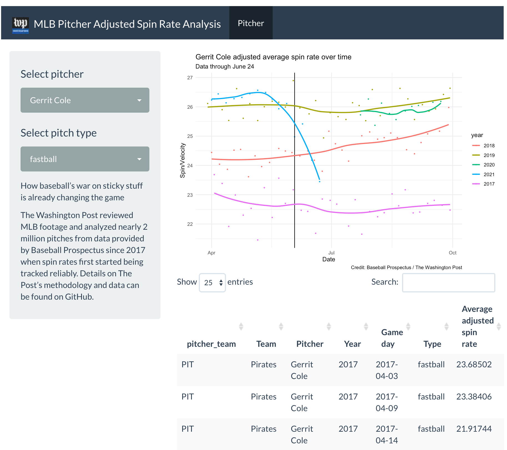

[This data is published under an [Attribution-NonCommercial-ShareAlike 4.0 International (CC BY-NC-SA 4.0) license](https://creativecommons.org/licenses/by-nc-sa/4.0/)]

# About this story

[How baseball’s war on sticky stuff is already changing the game](https://www.washingtonpost.com/sports/2021/07/02/sticky-stuff-baseball-data/)

The Washington Post reviewed MLB footage and analyzed nearly 2 million pitches, focusing primarily on fastballs, from data provided by [Baseball Prospectus](https://www.baseballprospectus.com/) since 2017 when spin rates first started being tracked reliably. Details on The Post’s methodology and summarized data through June 24 can be found within this repo.

# About the data

The raw data is unavailable to post here because it comes from Baseball Prospectus and is too large to put on Github


# Folders of note in this repo

* **[data/clean_data](data/clean_data)** - Cleaned up supplemental data used in the analysis

* **[outputs/findings](https://github.com/wpinvestigative/baseball_spin/tree/main/outputs/findings)** - R Markdown files used to generate exploratory data analysis

* **[scripts/analysis](scripts/analysis)** - Exploratory analysis scripts

https://github.com/wpinvestigative/baseball_spin/tree/main/outputs/findings


# Notebooks

* [Summary findings of spin rate analysis](http://wpinvestigative.github.io/baseball_spin/outputs/findings/01_exploratory.html) - Analysis of spin rates and pitchers and teams and hit rates
* [Table of pitchers spin rates over time](http://wpinvestigative.github.io/baseball_spin/outputs/findings/02_pitchers.html) - Searchable table of pitchers
* [Table of team spin rates over time](http://wpinvestigative.github.io/baseball_spin/outputs/findings/03_teams.html) - Searchable table of baseball teams


# Explorer app




To run the app, you must have [R version 3.5 or later](https://cloud.r-project.org/) installed first.

**Via terminal**

After you've installed R, In the terminal, run

```
R -e "install.packages('shiny', repos='https://cran.rstudio.com/')"
R -e "shiny::runGitHub('baseball_spin', 'wpinvestigative', ref="main", launch.browser=TRUE)"
```

**Via RStudio**

The application can be run locally with the following command in [R Studio](https://www.rstudio.com/products/rstudio/download/#download): 

```
install.packages("shiny", repos="https://cran.rstudio.com/")
shiny::runGitHub("baseball_spin", "wpinvestigative", ref="main")
```

**troubleshooting**

If you have connectivity issues, you may need to preinstall some packages:

```
# run these lines in RStudio console

packages <- c("tidyverse", "shiny", "shinyWidgets", "lubridate", "shinythemes", "DT")
if (length(setdiff(packages, rownames(installed.packages()))) > 0) {
  install.packages(setdiff(packages, rownames(installed.packages())), repos = "https://cran.us.r-project.org")  
}
```